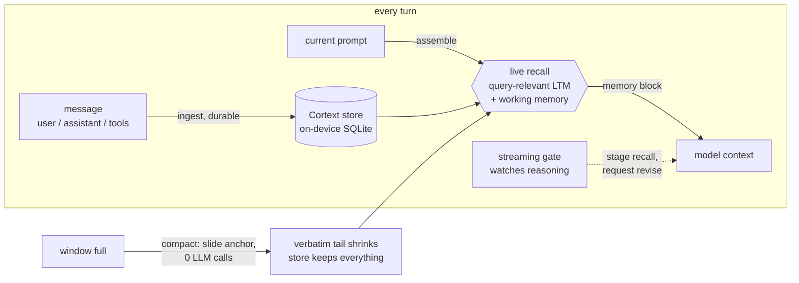
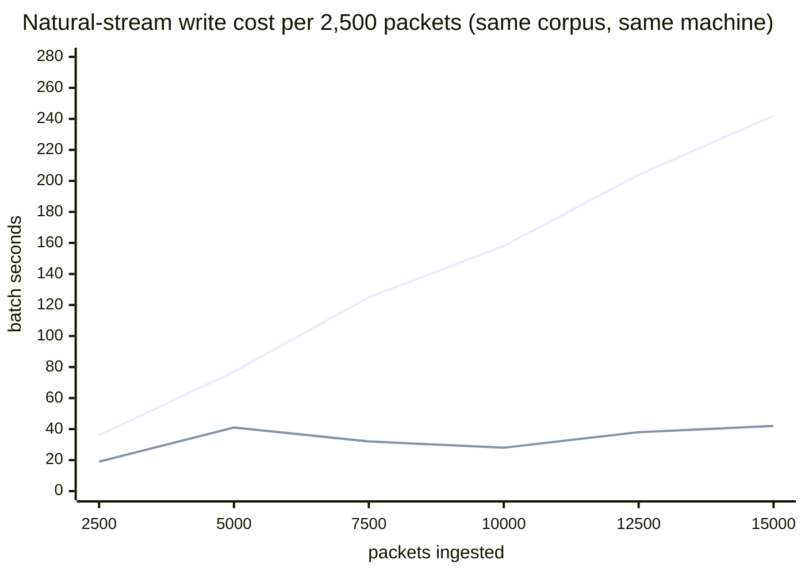

# Cortext for OpenClaw

[](https://www.npmjs.com/package/@augmem/cortext-openclaw-plugin)
[](./LICENSE)

**Living memory for [OpenClaw](https://openclaw.ai) agents — and compaction
for free.** Every message is written to a native, on-device memory engine
([`@augmem/cortext`](https://github.com/augmem/cortext)) as the conversation
happens, and every turn re-queries that memory live against the current
prompt. So when the context window fills up, nothing has to be summarized —
nothing was being thrown away in the first place.

```bash
openclaw plugins install @augmem/cortext-openclaw-plugin
```

## Why

- **Recall on every turn, not just after compaction.** Each assembly queries
  memory live with the current prompt — what gets injected is relevant to
  what's being asked *right now*, and a correction made this turn is
  reflected on the next (no cross-turn cache, no frozen digest). Mid-turn,
  a streaming gate watches the model's reasoning and can stage recall and
  request a revise before the answer is finalized.
- **Compaction with zero LLM calls.** Native compaction pays a summarizer
  every time the window fills and hopes the summary kept what you'll need.
  Cortext compaction just moves a window: a real ~372k-token session
  compacts to ~1.5k tokens instantly, for free, and archived content comes
  back through query-relevant recall every turn.
- **Measured against the alternative, not vibes.** On LLM-judged QA over
  archived-only content from a real 2,000-message session, window+recall
  scored **4/30** vs **1/30** for a real summarizer running OpenClaw's own
  compaction contract (16 LLM calls per compaction vs 0), with a window-only
  floor of 0/30. Nobody aces needle trivia over 372k tokens — but the free
  option loses nothing and recovers details no summary retains.
- **Fast enough to forget it's there.** Flat ~28ms per-message durable
  ingest, fully offline after a one-time model download, no per-turn
  network, no API keys.
- **Isolated by default.** One SQLite store per conversation — a shared
  channel bot can't leak one user's facts to another. Verified live, with
  positive controls.
- **The transcript is never mutated.** Compaction is a window over the
  on-disk transcript — never destructive surgery.

Everything above is reproducible from [`bench/`](bench/) against a real
`openclaw` gateway; every release ships only after the full live suite passes.

## The loop



Recall runs from turn one; compaction only changes how much verbatim tail
rides along — the memory side never changes.

## Compaction

Cortext owns the compaction slot (`ownsCompaction: true`) and never calls a
summarizer. Because every message is already in the durable store, `compact`
just picks an exchange-aligned cut in the conversation and anchors it; from
then on each `assemble` drops the archived prefix from the model context and
bridges it with recalled memory plus the live working-memory snapshot
(deduplicated against anything the kept tail already carries verbatim). The
on-disk transcript is untouched, and archived content keeps coming back
through query-relevant recall — fresher than any frozen summary.

The anchor is content-based *and* position-checked (duplicate message text
can't fool it), and self-healing: if the host rotates or rewrites the
transcript, the window clears and regrows rather than over-dropping.

Two modes (`compactionMode`):

- **`hybrid`** (default) — keep the system prompt + memory injection + a
  verbatim tail of the last `protectTail` messages, walked back to a
  user-message boundary so the tail is a self-contained exchange.
- **`full`** — keep the system prompt + memory injection only; the verbatim
  window shrinks to the current exchange. Maximum savings — memory IS the
  context.

## Write cost stays bounded

Per-write cost naturally creeps up as a store grows; the engine watches its
own write-rate envelope and raises a consolidation hint when throughput
drifts, and a sub-second consolidation pass knocks the cost back down — a
small, bounded sawtooth instead of unbounded growth. Measured on the same
real ~372k-token corpus streamed as 15,709 sentence packets (worst-case
write pressure; whole-message ingest is ~8× fewer writes):



On 1.2.3 the hint fired ~every 500 packets and each consolidation cost
~60ms; the full 15.7k-packet stream ingested in 214s vs ~1,000s on 1.2.2.
Whole-message durable ingest (the plugin's default) runs ~28ms per message,
flat. The plugin consolidates at compaction time (`autoConsolidate`).

## How it plugs in

Two OpenClaw surfaces (verified against the installed `openclaw` package's
types, not docs):

1. **Context engine** (`api.registerContextEngine`) — Cortext owns the
   exclusive `plugins.slots.contextEngine` slot: `ingest` writes each message
   (user, assistant, tool calls, tool results) to durable memory, `assemble`
   prepends live recall to the system prompt, and `compact` slides the
   window.
2. **Streaming gate** (`api.agent.events.registerAgentEventSubscription`) —
   feeds `thinking` (reasoning) and `assistant` deltas through Cortext's
   interrupt gate as they stream. On `should_interrupt` / `at_boundary` the
   recalled memory is staged for the next assembly and — via
   `api.on("before_agent_finalize")` — a revise of the current answer is
   requested (see [limits](#design-and-limits)).

## Install & configure

```jsonc
// openclaw.json
{
  "plugins": {
    "slots": { "contextEngine": "cortext" },
    "entries": {
      "cortext": {
        "config": { "memoryScope": "session", "focus": 0.45 },
        // Only needed for the interrupt re-pass (forceRepass). OpenClaw blocks
        // the before_agent_finalize hook for non-bundled plugins without it.
        "hooks": { "allowConversationAccess": true }
      }
    }
  }
}
```

If no engine is selected, OpenClaw runs its built-in `legacy` engine and this
plugin is not used.

Requirements: Node.js ≥ 18; a platform with a `@augmem/cortext` native
prebuild (installed as a dependency). On first use Cortext downloads its
local model assets once; after that, memory runs fully offline.

Under `plugins.entries.cortext.config`:

| Key | Default | Meaning |
|-----|---------|---------|
| `dbPath` | `cortext` | Directory (under the agent dir) for Cortext stores |
| `memoryScope` | `session` | Isolation boundary: `session` / `agent` / `global` |
| `focus` | `0.45` | F knob: retrieval breadth vs precision |
| `sensitivity` | `0.5` | S knob: affective relaxation of the gate |
| `stability` | `0.5` | T knob: gate refractory + boundary pacing |
| `recallLimit` | `12` | max memories injected per assembly |
| `interruptGate` | `true` | run the streaming gate |
| `ingestReasoning` | `true` | feed `thinking` deltas, not just answer text |
| `forceRepass` | `true` | request a revise on interrupt (gateway only; no-op elsewhere) |
| `autoConsolidate` | `true` | consolidate on compaction |
| `compactionMode` | `hybrid` | `hybrid`: memory + verbatim tail; `full`: memory only |
| `protectTail` | `6` | hybrid: trailing messages kept verbatim (exchange-aligned) |

## Isolation

Cortext keeps one SQLite store **per isolation scope** — source ids are
metadata within a store, so distinct scopes are distinct databases (staged
gate memory is keyed by the same scope, so it can't cross the boundary
either). `memoryScope`:

- **`session`** (default) — one store per conversation. Safe when an agent
  serves multiple people (a shared channel bot): memory never crosses
  conversations.
- **`agent`** — one store per agent identity; memory persists across that
  agent's sessions. Use only for **single-user** agents — it shares memory
  across every conversation the agent handles.
- **`global`** — a single shared store.

Session keys always fold into the scope key (a sessionId alone is not unique
across agents), and an absent/non-canonical agent normalizes to `main` like
OpenClaw. Both session and agent isolation are asserted live by the
integration suite, each with a positive control (the same scope *does*
recall the fact; the needle is a nonsense token a model can't guess).

## Design and limits

- **Recalled memory is untrusted input.** A prior turn could have ingested a
  prompt-injection payload. Before injection, recalled text is stripped of
  data-fence breakouts and fake system markers, and wrapped in a block that
  explicitly labels it as reference data, not instructions. This is a
  mitigation, not a guarantee.
- **Fine-grained recall is a work in progress.** Retrieval reliably brings
  back conversationally salient facts (decisions, named results, user
  statements); one-off identifiers buried in bulk tool output are hit or
  miss — needle probes on a real 372k-token transcript improved release
  over release (1/7 → 3/7 → 4/7 across engine 1.2.1 → 1.2.3) but are not
  at ceiling. For calibration: a real summarizer scored 0 uniquely-recovered
  details on the same corpus.
- **The gate cannot splice into a live decode.** The agent event stream is
  observe-only, so on interrupt the plugin stages recall for the next
  assembly and requests a `revise` via `before_agent_finalize`. This fires
  only on the full gateway path (`openclaw gateway run`), requires
  `hooks.allowConversationAccess: true`, is capped by the host's per-run
  retry budget, and is a safe no-op everywhere else.
- **Tool-call arguments are truncated at 2,000 chars** in the durable record
  (the command matters; a 100KB patch payload shouldn't dominate the store).
  Tool *results* are ingested in full.
- **The engine's consolidation hint is deliberately not acted on at ingest.**
  Measured retrieval is identical with and without it; compact-time
  consolidation is the sufficient, safe cadence today.

## Verified

Every release passes, against a real `openclaw` gateway and the shipped
engine, before publish:

- **Unit + types** — `npm test` (49 tests, native engine, offline) and
  `npm run typecheck`. The test api double mirrors the real injected
  surface, so an unsupported call fails tests.
- **Isolation live** — [`bench/integration.mjs`](bench/integration.mjs):
  session scope cannot read another session's fact; agent `bob` cannot read
  agent `main`'s memory; positive controls recall in-scope; corrected facts
  are never served stale.
- **Gateway hooks live** —
  [`bench/integration-gateway.mjs`](bench/integration-gateway.mjs): the gate
  subscribes and processes a routed turn without error;
  `before_agent_finalize` fires.
- **Compaction live** —
  [`bench/integration-compaction.mjs`](bench/integration-compaction.mjs):
  budget pressure forces engine compaction with zero summarizer calls; the
  transcript proves the needle exists only in the archived prefix; the next
  turn answers it from memory injection alone.
- **Judged replay** — [`bench/replay-judged.mjs`](bench/replay-judged.mjs):
  replays a real transcript through ingest → compact → QA, scoring
  window+recall against a real summarizer running OpenClaw's own compaction
  contract and a window-only floor, with an LLM judge.

```bash
npm run test:integration              # isolation, live gateway
npm run test:integration:gateway      # streaming gate + finalize hook
npm run test:integration:compaction   # full compaction cycle
```

(The live suites need an `OPENAI_API_KEY` for the gateway's model.)

## Develop

```bash
npm install
npm run build       # tsc → dist/
npm run typecheck
npm test            # build + unit tests (native engine; fast, offline)
```

`src/openclaw.d.ts` is transcribed from the **installed** `openclaw`
package's types — if OpenClaw's plugin surface changes, the transcription is
re-verified against the real package, not docs.

## License

Apache-2.0. See [LICENSE](./LICENSE) and [NOTICE](./NOTICE).
